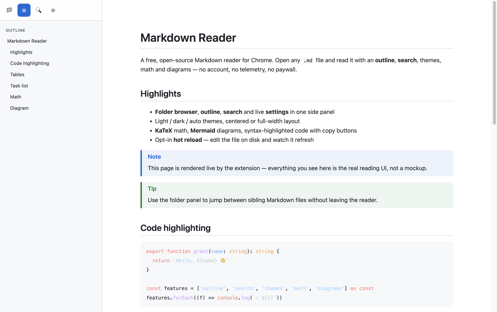
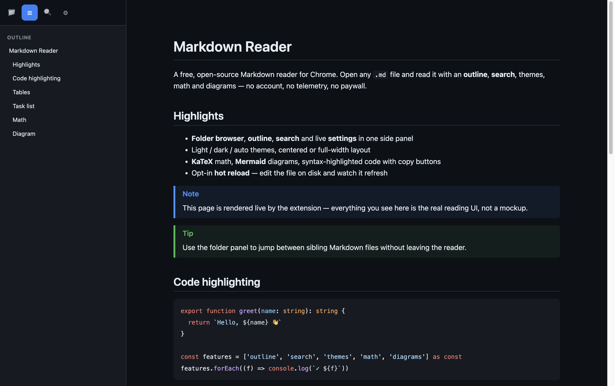
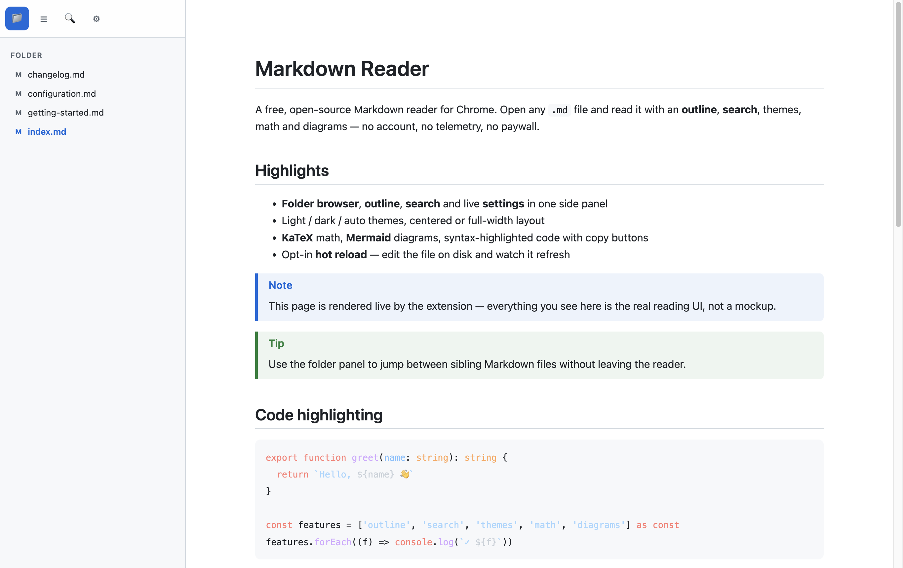
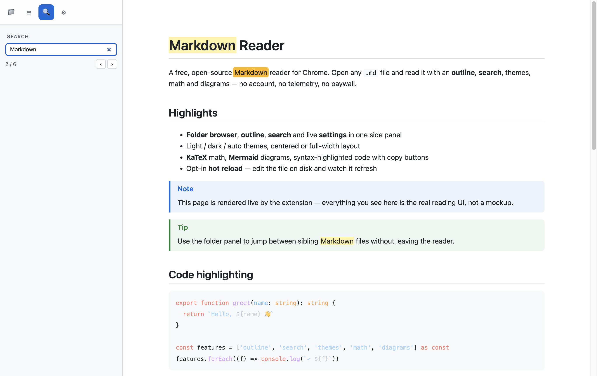
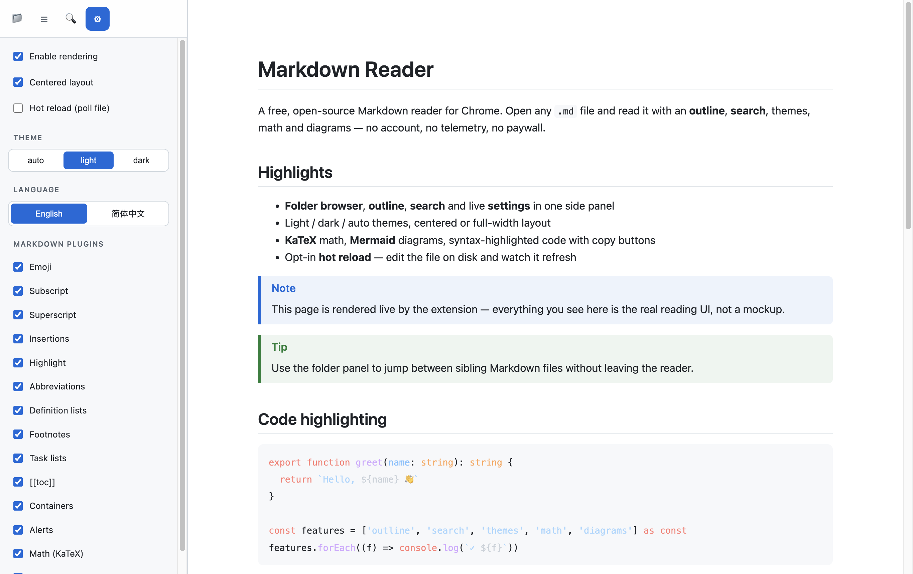
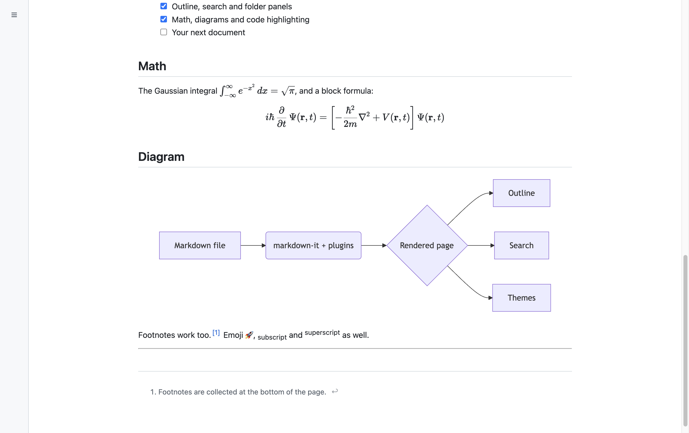
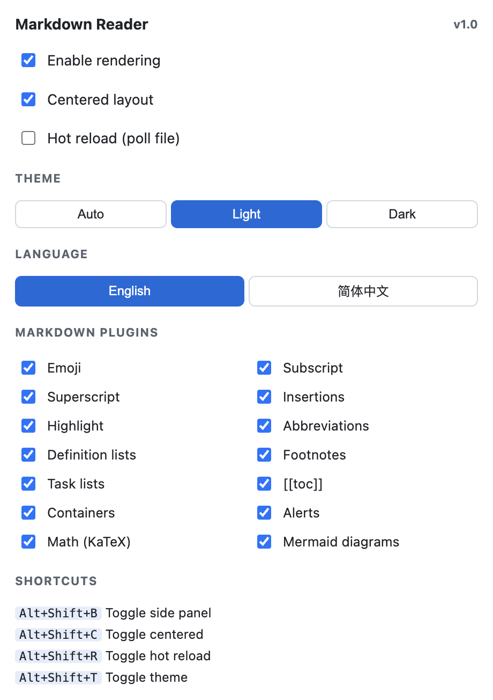

# Markdown Reader (Markdown 阅读器)

> 一个免费的 MV3 Chrome 扩展，用于在本地和网页上预览 Markdown 文件，提供完整的阅读体验。
> [English](README.md) | 中文文档

## 截图

<table>
  <tr>
    <td align="center"><b>阅读视图</b> · 大纲 · 浅色<br></td>
    <td align="center"><b>深色主题</b><br></td>
  </tr>
  <tr>
    <td align="center"><b>文件夹浏览器</b> · 同级 <code>.md</code> 文件<br></td>
    <td align="center"><b>全文搜索</b> · 匹配跳转<br></td>
  </tr>
  <tr>
    <td align="center"><b>实时设置</b> · 主题 · 语言 · 插件<br></td>
    <td align="center"><b>KaTeX 数学公式 &amp; Mermaid 图表</b><br></td>
  </tr>
  <tr>
    <td colspan="2" align="center"><b>工具栏弹窗</b><br></td>
  </tr>
</table>

<sub>所有图片均由扩展从 <a href="screenshots/demo-folder/index.md"><code>screenshots/demo-folder/index.md</code></a> 实时渲染 —— 运行 <code>node screenshots/capture.mjs</code> 可重新生成。</sub>

## 为什么做这个

专注、开源的 Chrome Markdown 阅读器——**无付费墙、无数据采集、不需要账号**。核心特性：

- 在 `file://` / `http://` / `https://` 页面上渲染 `.md` / `.markdown` / `.mkd` / `.mdx`
- 4 按钮侧边面板：**文件夹浏览器** • **大纲** • **搜索** • **设置**
- 浅色 / 深色 / 跟随系统主题；居中和全宽两种布局
- markdown-it 全套插件集（emoji、上下标、插入、高亮、缩写、定义列表、脚注、
  任务列表、多列表格、容器、提示框、TOC）
- **KaTeX** 数学公式和 **Mermaid** 图表
- highlight.js 代码高亮 + 一键复制按钮 + 图片灯箱
- 可选**热重载**（每 0.5 秒轮询文件）
- 配置通过 `chrome.storage.local` 持久化，支持标签页间实时同步
- 快捷键：`Alt+Shift+B/C/R/T`
- 中英文界面（跟随系统语言自动切换）

## 安装（开发者版本）

```sh
pnpm install
pnpm build           # 编译产物在 .output/chrome-mv3
```

1. 打开 `chrome://extensions`，打开 **开发者模式**。
2. 点击 **加载已解压的扩展程序**，选择 `.output/chrome-mv3` 目录。
3. 点击扩展的 **详情** → 勾选 **允许访问文件网址**
   （渲染本地 `file://` 文件和文件夹面板必须启用）。
4. 在 Chrome 中打开 `file:///…/example/index.md` 即可体验。

## 开发流程

```sh
pnpm dev             # 带热重载的开发版，输出在 .output/chrome-mv3
pnpm check           # svelte-check + tsc
pnpm zip             # 生成可安装的 zip 包
```

## 实现原理

| 模块 | 机制 |
|------|------|
| Markdown 页面检测 | URL 匹配（manifest `matches`） + `document.contentType ∈ {text/plain, text/markdown, text/x-markdown}` |
| 读取原始内容 | 直接读取 Chrome 已经渲染好的 `<pre>` 元素 |
| 页面接管 | 隐藏原始 `<pre>`，挂载 Svelte 应用，通过 `data-mdr-theme` 控制主题 |
| 热重载 | Service Worker 在 500 ms `setTimeout` 链中 `fetch(tab url)`；全文本 diff 后重渲染 |
| 文件夹浏览器（`file://`）| SW fetch 父目录；Chrome 返回带 `addRow(...)` 内联脚本的 HTML，我们用正则防御性解析 |
| 设置 | 通过 WXT 的 typed `storage.defineItem` + `chrome.storage.local`；watcher 将变更实时推送到所有标签页和弹窗 |
| 快捷键 | `manifest.commands` → SW `chrome.commands` → `tabs.sendMessage` 到当前活动标签页 |

## 已知限制

- **"允许访问文件网址"** 必须用户手动启用，扩展无法以编程方式请求。未启用时，
  `file://` 页面和文件夹面板均不可用。
- 文件夹面板依赖 Chrome 内部目录列表的 HTML 格式（未公开文档）。解析器做了防御处理，
  但如果 Chrome 格式变化需要更新。
- Web 服务器用 `text/html` 或 `application/octet-stream` 提供 `.md` 文件时，
  Chrome 不会把它当成纯文本，扩展不会触发。

## 许可证

MIT.
