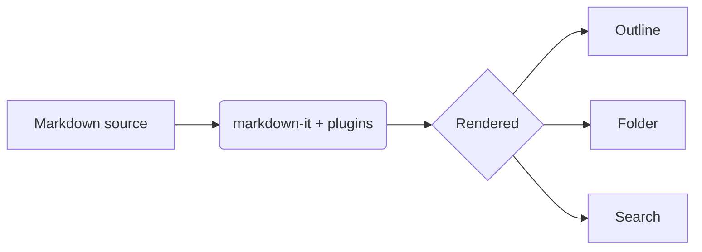
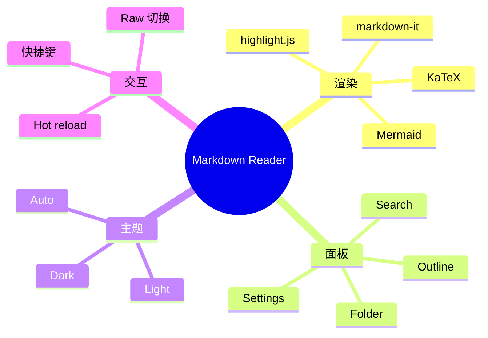
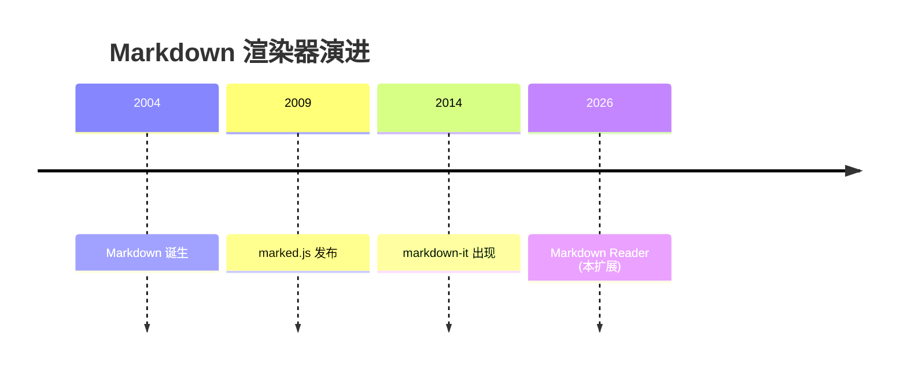
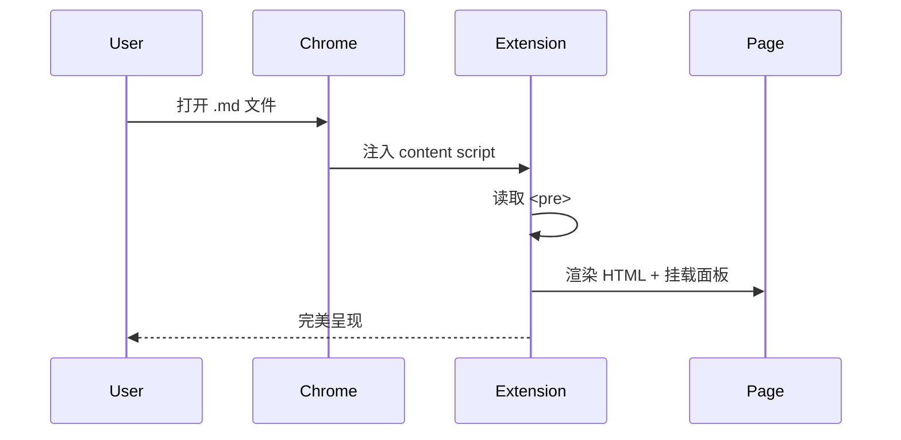

# Welcome to Markdown Reader

This file exercises every feature of the extension. Open it from your
filesystem (drag into Chrome, or `file:///…/example/index.md`).

## Why this extension

- Renders local `.md`/`.mkd`/`.mdx`/`.markdown` files
- Sibling-file **folder browser**
- **Outline**, **search**, and live settings panels
- Light / dark / auto themes
- KaTeX math, Mermaid diagrams, syntax highlighting

> Built as a free, open-source Markdown reader extension.

## Code highlighting

```ts
function greet(name: string): string {
  return `Hello, ${name}!`
}
```

```python
def fib(n):
    a, b = 0, 1
    for _ in range(n):
        a, b = b, a + b
    return a
```

## Tables

| Feature | Status | Notes |
| ------- | ------ | ----- |
| Folder  | ✅     | file:// only |
| Outline | ✅     | scroll-spy |
| Search  | ✅     | next/prev nav |
| Hot reload | ✅  | opt-in (popup) |

## Task list

- [x] Render markdown
- [x] Outline panel
- [x] Folder panel
- [ ] Your custom theme

## Math

Inline: $E = mc^2$ and $\int_0^\infty e^{-x^2}\,dx = \tfrac{\sqrt{\pi}}{2}$.

Block:

$$
\frac{1}{\pi} \int_0^\pi \cos(n\theta) \, d\theta
= \begin{cases} 1 & n = 0 \\ 0 & n \ne 0 \end{cases}
$$

## Diagram



## Mindmap (思维导图)



## Timeline (时间线)



## Sequence (时序图)



## Footnotes, emoji, sub/sup

This sentence has a footnote.[^1] Emoji: :rocket: :sparkles:.
Water is H~2~O. Einstein wrote E=mc^2^.

[^1]: Footnotes are rendered at the bottom.

## Alerts

> [!NOTE]
> Useful information that users should know.

> [!WARNING]
> Critical content that could lead to data loss.

## Image


— end of file
