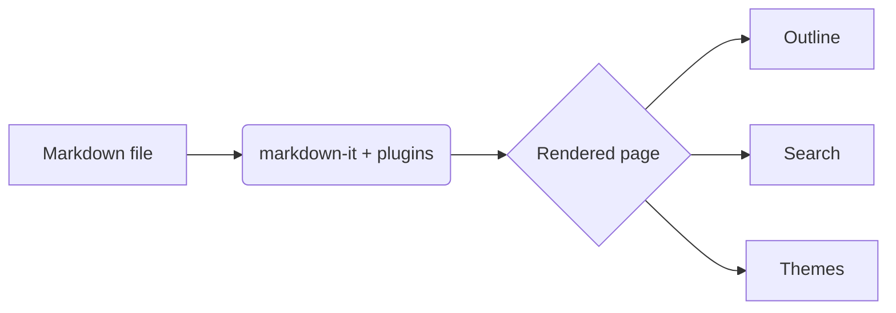

# Markdown Reader

A free, open-source Markdown reader for Chrome. Open any `.md` file and read it
with an **outline**, **search**, themes, math and diagrams — no account,
no telemetry, no paywall.

## Highlights

- **Folder browser**, **outline**, **search** and live **settings** in one side panel
- Light / dark / auto themes, centered or full-width layout
- **KaTeX** math, **Mermaid** diagrams, syntax-highlighted code with copy buttons
- Opt-in **hot reload** — edit the file on disk and watch it refresh

> [!NOTE]
> This page is rendered live by the extension — everything you see here is the
> real reading UI, not a mockup.

> [!TIP]
> Use the folder panel to jump between sibling Markdown files without leaving
> the reader.

## Code highlighting

```ts
export function greet(name: string): string {
  return `Hello, ${name} 👋`
}

const features = ['outline', 'search', 'themes', 'math', 'diagrams'] as const
features.forEach((f) => console.log(`✓ ${f}`))
```

## Tables

| Panel    | Shortcut       | Notes              |
| -------- | -------------- | ------------------ |
| Outline  | `Alt+Shift+B`  | scroll-spy nav     |
| Search   | —              | next / prev match  |
| Settings | —              | live toggles       |
| Folder   | —              | `file://` browsing |

## Task list

- [x] Render Markdown beautifully
- [x] Outline, search and folder panels
- [x] Math, diagrams and code highlighting
- [ ] Your next document

## Math

The Gaussian integral $\int_{-\infty}^{\infty} e^{-x^2}\,dx = \sqrt{\pi}$, and a
block formula:

$$
i\hbar\,\frac{\partial}{\partial t}\,\Psi(\mathbf{r}, t)
= \left[ -\frac{\hbar^2}{2m}\nabla^2 + V(\mathbf{r}, t) \right]\Psi(\mathbf{r}, t)
$$

## Diagram



Footnotes work too.[^1] Emoji :rocket:, ~subscript~ and ^superscript^ as well.

[^1]: Footnotes are collected at the bottom of the page.
